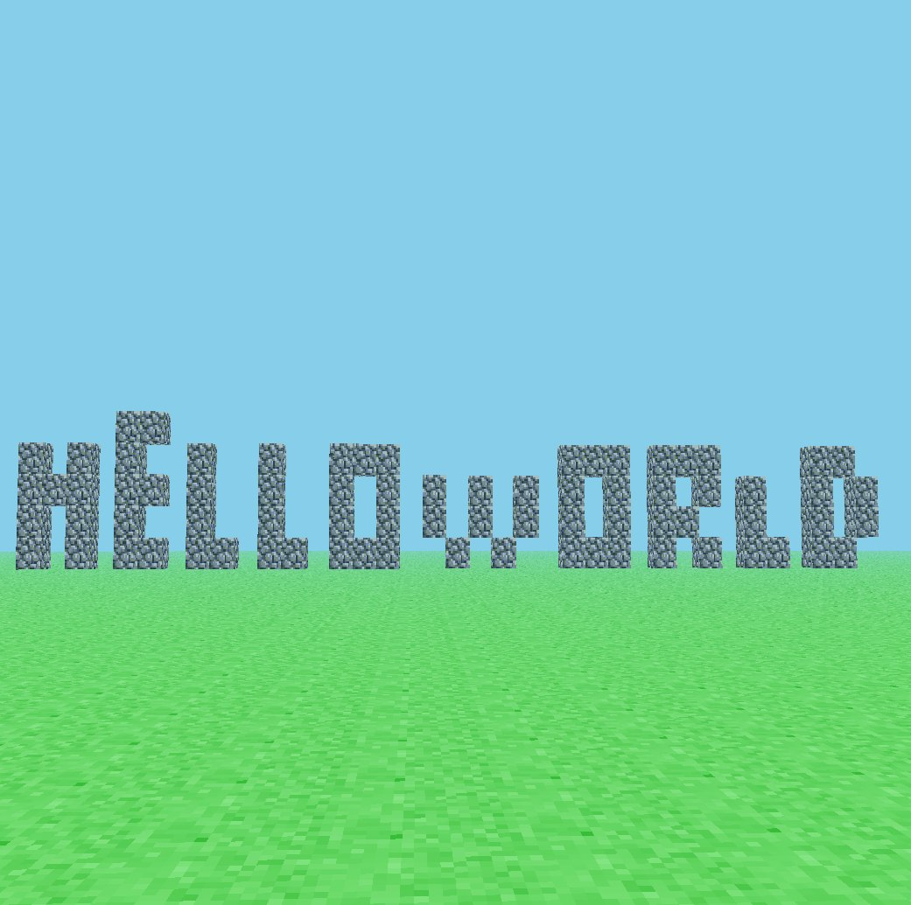

A recreation of the first version of Minecraft made in little over an hour from an voxel engine I'm currently working on

It depends on opengl 2.1 

```bash
go build -o rd *.go

GOOS=windows GOARCH=386 CGO_ENABLED=1 CXX=i686-w64-mingw32-g++ CC=i686-w64-mingw32-gcc go build -o rd.exe *.go
```
